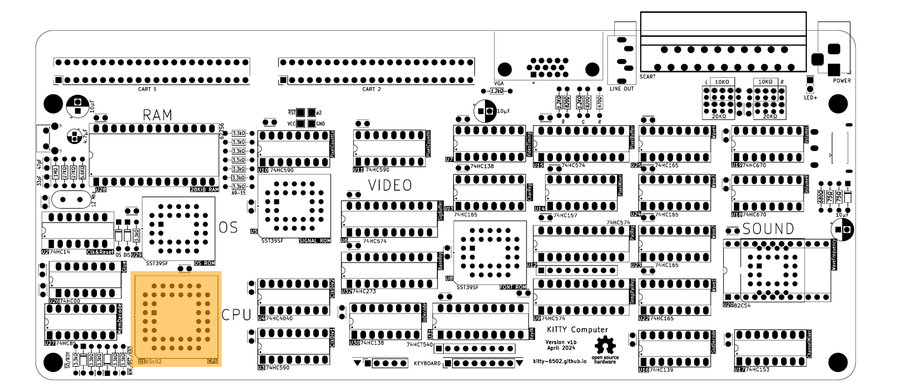

# Interrupts

On the 65c02, vectors are a series of 16-bit addresses located at the very top of memory, that provide to the processor the location of a subroutine to execute whenever a given external hardware signal is received.

| Interrupt | Address       |
|-----------|---------------|
| IRQ       | `$FFFE-$FFFF` |
| BRK       | `$FFFE-$FFFF` |
| RESET     | `$FFFC-$FFFD` |
| NMI       | `$FFFA-$FFFB` |

Interrupts subroutines operate very similarly to regular subroutines, but are exit through a `RTI` instruction instead of `RTS`.

## RESET - Reset

The 65c02, like most other CPU architectures, utilizes a RESET signal in order to initialize the processor to a known and stable starting state. On the KITTY, this signal is triggered on power-up, as well as when the user manually presses the reset button.

Reset utilizes the vector at `$FFFC-$FFFD`, additionally, it also clears the BANK register to `$00`, meaning that code execution on the KITTY will always start at bank 0 of cart 0.

## IRQ - Interrupt Request

The KITTY possesses a single 50hz IRQ interrupt that is generated by the video circuit's signal ROM, whenever the last visible pixel on a given frame is drawn to the screen. It utilizes the vector at`$FFFE-$FFFF`.

This signal is the main method of keeping time on the system, allowing for code to run at a predictable pace, essential for the update loops of many programs and games.

IRQ can be optionally disabled or enabled by the CPU at any time through the use of the `SEI` and `CLI` instructions, respectively. Note that on reset, IRQs will always be disabled, so the programmer must remember to enable them if they wish to make use of this feature.

### WAI - Wait for Interrupt

The 65c02 designed by the Western Design Center, introduced a new "Wait for Interrupt" Instruction (`WAI`), that as implied by the name, causes the CPU to "Wait" in place until awaken by an interrupt.

While this instruction achieves a similar function as to what waiting on a infinite loop in older 65x processors would, it also has an additional and very useful quirk: when an IRQ is triggered while Interrupts are disabled, the Wait state will end and execution will move on to the next instruction, bypassing the Interrupt Vector and associated routine entirely, and reacting within a single clock cycle.

This can allow for code that is a lot more flexible, faster, and pleasant to write.

## NMI - Non-maskable Interrupt

The NMI, non-maskable interrupt, operates very similarly to IRQ, except that it can not be disabled in software. It uses the vector at `$FFFA-$FFFB`.

On a vanilla KITTY, there is no hardware that generates this interrupt, but it is avaliable on the cartridge ports for use by potential peripheral expansions.

## BRK - Break

BRK is a software triggered interrupt, which shares the same Vector as IRQ (`$FFFE-$FFFF`). It can be distinguished from an IRQ by checking if the B bit (4th bit) on the processor status register, that was pushed to the stack, was set to 1.

BRK is a two-byte instruction, with the second byte being unused and having no effect, however some assemblers might allow for this extra byte to be set to an arbitrary given value.

Overall, BRK is rarely used in software, but is described here for the sake of completion.